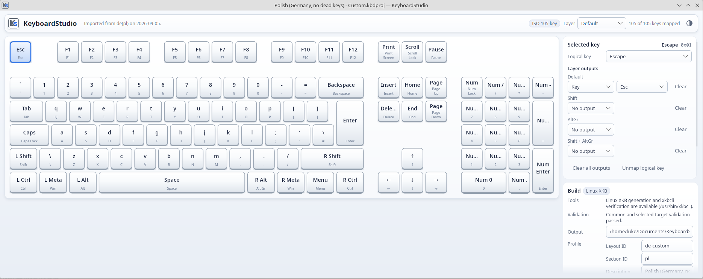
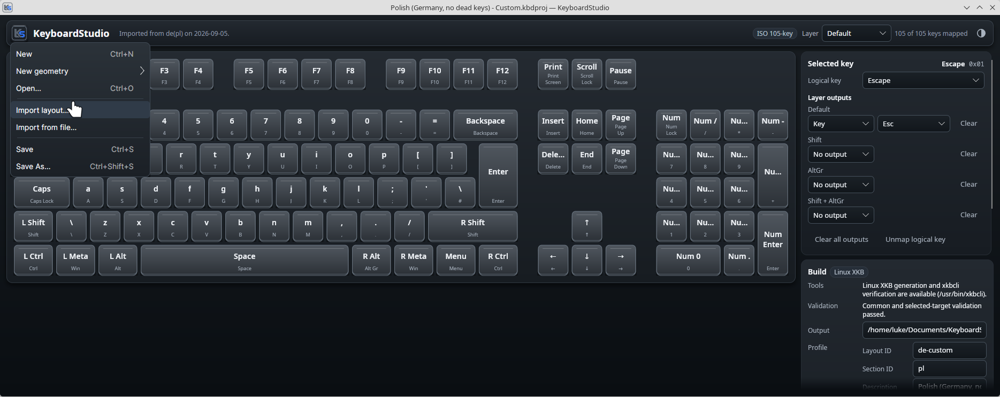
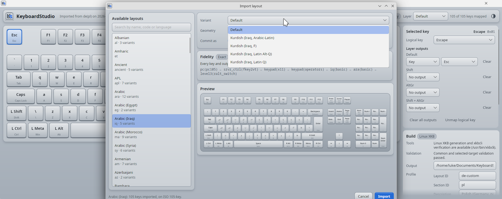

# KeyboardStudio

KeyboardStudio is a cross-platform desktop editor for creating custom keyboard layouts visually.
It displays an ISO-105 or ANSI-104 keyboard, lets you assign logical keys and outputs for four
modifier layers, validates the result, and saves the work as a portable `.kbdproj` project.

The application can generate:

- portable Linux XKB symbols components, including optional user-scoped installation of variants
  derived from an installed system layout; and
- verified native Windows x64 keyboard-layout DLLs when the required Microsoft toolchain is
  available.

The current user interface is Linux-focused and shows the Linux XKB build target by default. The
Windows backend remains available by starting KeyboardStudio with `KEYBOARDSTUDIO_TARGETS=all`.

## Screenshots







## Requirements

Two separate sets that are easy to confuse. One is what a machine needs to **compile**
KeyboardStudio and the artifacts it emits; the other is what an operating system must already
provide for the built application to **function**. A host can satisfy either one without the other.

### Tools required to compile

| To build | Requirement |
|---|---|
| The application, the libraries, and every test | A .NET 10 SDK, version 10.0.100 or a later 10.0 feature band, as pinned by [`global.json`](global.json). Every project targets `net10.0`. |
| A published, self-contained application | The `win-x64` or `linux-x64` runtime identifier. See [docs/PACKAGING.md](docs/PACKAGING.md). |
| A native Windows keyboard-layout DLL | Windows on x64, with the MSVC x64 toolchain (`cl.exe`, `link.exe` from `bin/Hostx64/x64`) and a Windows 10/11 SDK supplying `rc.exe`, the `ucrt`/`shared`/`um` headers, and the matching x64 libraries. Discovered through `VCToolsInstallDir`, `VSINSTALLDIR`, `vswhere.exe`, `WindowsSdkDir`, and `WindowsSDKVersion`. See [Windows build prerequisites](docs/WINDOWS-BUILD.md#prerequisites). |
| A Linux XKB symbols component | Nothing beyond the SDK. `xkbcli compile-keymap` is optional locally, where it adds external compilation verification on top of the managed structural checks; Linux CI always requires it. |

Editing, persistence, validation, and Linux XKB generation need no native development toolchain.

### OS requirements to function

| To use | Requirement |
|---|---|
| The editor itself | An x64 Windows or Linux desktop. |
| Startup on this host's current layout (Linux) | A readable canonical system XKB data root, normally `/usr/share/X11/xkb`. Without it the populated `us-basic` seed opens instead. |
| Generating and exporting an XKB bundle | Nothing further. This stays available on every host below. |
| Managed per-user installation — **Install**, **Update**, **Verify installed**, **Uninstall** | Every item in the list below. |

Managed per-user installation is a libxkbcommon user-configuration feature rather than a universal
Linux keyboard path, so all of the following must hold at once. Miss any one and the Linux
user-variant panel keeps **Generate bundle** enabled and disables the other four:

- **A Wayland session** (`XDG_SESSION_TYPE=wayland`) whose compositor compiles keymaps with
  libxkbcommon. An X11 session is export-only: the X server uses hard-coded XKB paths and does not
  treat the XDG directory as a replacement root.
- **libxkbcommon 1.11.0 or newer**, required for the `%S` system-section include that inherits the
  base layout. 1.12.2 or newer is the recommended baseline, because it also carries the
  canonical-root fallback some xkeyboard-config 2.45+ installations need.
- **`xkbcli` on `PATH`**, used to compile the keymap before and after writing anything. The shared
  library alone is not enough; it lives in a separate package on most distributions:

  | Distribution family | Install command |
  |---|---|
  | Fedora, RHEL | `sudo dnf install libxkbcommon-utils` |
  | Debian, Ubuntu, Linux Mint, Pop!_OS, KDE neon | `sudo apt install libxkbcommon-tools` |
  | Arch Linux, Manjaro | `sudo pacman -S libxkbcommon` (ships `xkbcli` in the library package) |
  | openSUSE | `zypper search --provides xkbcli`, then install what it names |

- **A canonical system XKB root** (`/usr/share/X11/xkb`) to inherit the imported base layout from.
- **Absolute, unsuspicious XDG paths**: `XDG_CONFIG_HOME` and `XDG_STATE_HOME`, or an absolute
  `HOME` for the `~/.config` and `~/.local/state` fallbacks. Installation writes only beneath
  `$XDG_CONFIG_HOME/xkb` and `$XDG_STATE_HOME/keyboardstudio/xkb`; a relative value disables it. An
  absent `~/.config/xkb` is normal, and the first approved installation creates it.
- **A desktop settings tool that reads libxkbregistry**, if the variant is to appear in the layout
  chooser on its own. This one is not a hard requirement: without it installation is still offered,
  with a warning, and KeyboardStudio reports registry discovery separately from keymap compilation.

The panel decides from a live probe of the running host, never from a distribution name, and shows
what it found in its capability and diagnostics lines. To check the same facts by hand:

```bash
printf 'session=%s wayland=%s\n' "$XDG_SESSION_TYPE" "$WAYLAND_DISPLAY"
command -v xkbcli && xkbcli --version
```

Nothing here is needed to edit, validate, save, or export. Installation is always explicitly
confirmed, never automatic, and never activates a layout. The full capability model, reduced modes,
per-distribution expectations, and troubleshooting are in
[Linux per-user XKB variants](docs/LINUX-USER-XKB-VARIANTS.md#4-runtime-requirements-and-compatibility).

## Build and run

From the repository root, the Bash launcher restores the solution, compiles the Avalonia
application, and starts it:

```bash
./scripts/run-app.sh
```

To compile and start it manually on Windows or Linux:

```bash
dotnet restore KeyboardStudio.slnx
dotnet build src/KeyboardStudio.App/KeyboardStudio.App.csproj --no-restore
dotnet run --project src/KeyboardStudio.App/KeyboardStudio.App.csproj --no-build --no-restore
```

Set `KEYBOARDSTUDIO_CONFIGURATION=Release` when using the Bash launcher for a Release build. See
[desktop packaging](docs/PACKAGING.md) for self-contained `win-x64` and `linux-x64` publishing.

## How to use KeyboardStudio

1. **Choose a starting layout.** On Linux, a new window tries to load the host's current layout and
   otherwise opens the populated `us-basic` seed. Use the `K` menu to create a different geometry,
   open a `.kbdproj`, import an installed Linux layout, or import a loose layout file.
2. **Edit a key.** Select a physical key, choose its logical key, and assign a key or character to
   the `Default`, `Shift`, `AltGr`, and `Shift + AltGr` layers. The layer selector above the keyboard
   changes which output is displayed on every key.
3. **Save the project.** Use **Save As** (`Ctrl+Shift+S`) for a new `.kbdproj`; later changes can be
   saved with `Ctrl+S`.
4. **Generate an artifact.** Choose an output directory, complete the target profile, and select
   **Build**. Normal builds generate and verify files but do not install or activate a layout.
5. **Optionally install a Linux user variant.** Projects imported from the system catalog can
   generate and, on a supported Wayland/libxkbcommon host, install a managed per-user variant. You
   must still select that variant in the desktop's keyboard settings; KeyboardStudio never
   activates it automatically.

The appearance button at the right of the header switches between White, Gray, and Black themes.
The choice is remembered locally and is not stored in the keyboard project.

## Scope and limitations

KeyboardStudio supports ISO-105 and ANSI-104 geometry, four output layers, one Unicode scalar per
character output, JSON project persistence, continuous validation, Linux XKB generation, and
Windows x64 DLL generation. Linux artifacts receive managed structural verification and optional
`xkbcli` compilation verification; Windows artifacts are checked for architecture, DLL properties,
and the required `KbdLayerDescriptor` export.

The current release does not support dead keys, chained dead keys, ligatures, macros, IMEs, runtime
keyboard hooks, PowerToys-style remapping, or importing arbitrary existing Windows keyboard DLLs.
Linux output is not a distribution package, Windows output requires an x64 Windows build host, and
supplementary-plane Unicode output is not supported by the Windows backend. The repository does not
include an application installer, updater, or signing pipeline.

## Further documentation

- [Architecture](docs/ARCHITECTURE.md)
- [Project file format](docs/PROJECT-FORMAT.md)
- [Linux layout import](docs/LINUX-LAYOUT-IMPORT.md)
- [Linux XKB generation](docs/LINUX-XKB.md)
- [Linux per-user XKB variants](docs/LINUX-USER-XKB-VARIANTS.md)
- [Windows build prerequisites and pipeline](docs/WINDOWS-BUILD.md)
- [Packaging](docs/PACKAGING.md)
- [Testing](docs/TESTING.md)

## References

- [Avalonia documentation](https://docs.avaloniaui.net/)
- [Microsoft Windows keyboard-layout samples](https://github.com/microsoft/Windows-driver-samples/tree/main/input/layout)
- [libxkbcommon XKB text format](https://xkbcommon.org/doc/current/keymap-text-format-v1-v2.html)